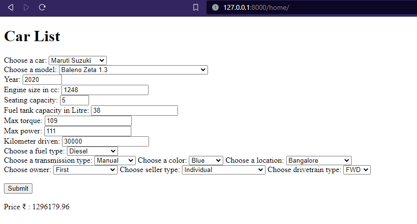
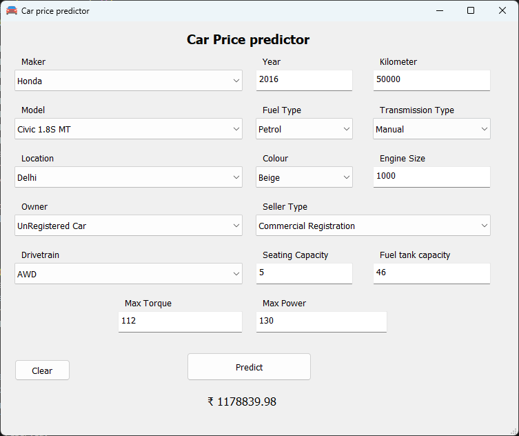
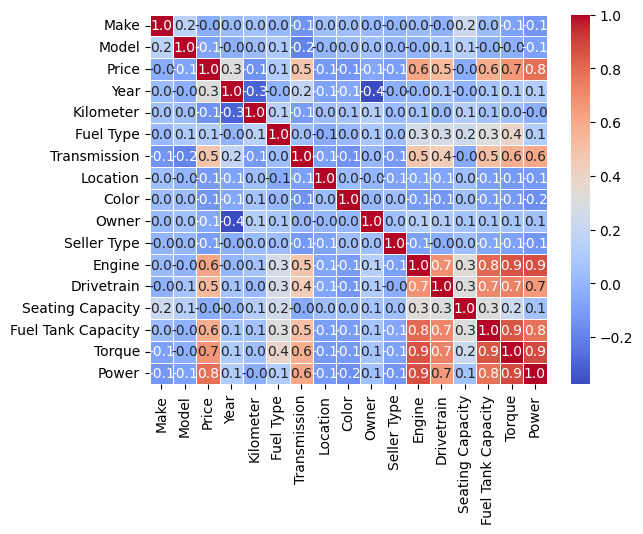

# Car-Price-predictor
Car-Price-predictor

## Parameters
- `Make` - car maker
- `Model` - car model
- `Year` - year in which car manufactured
- `Kilometer` - Kms driven
- `Fuel type` - type of fuel
- `Transmission` - Automatic / Manual
- `Location` - Car's location
- `Color` - Car's color
- `Owner`
- `Seller type`
- `Engine` - Engine size
- `Drivetrain`
- `Seating Capacity`
- `Fuel Tank Capacity`
- `Torque`
- `Power`

## Accuracy
Linear Reg R-squared: 0.7470847263655592
Decision tree R-squared: 0.9349700627243769
Random Forest R-squared: 0.9436199230134352

## Screenshots

